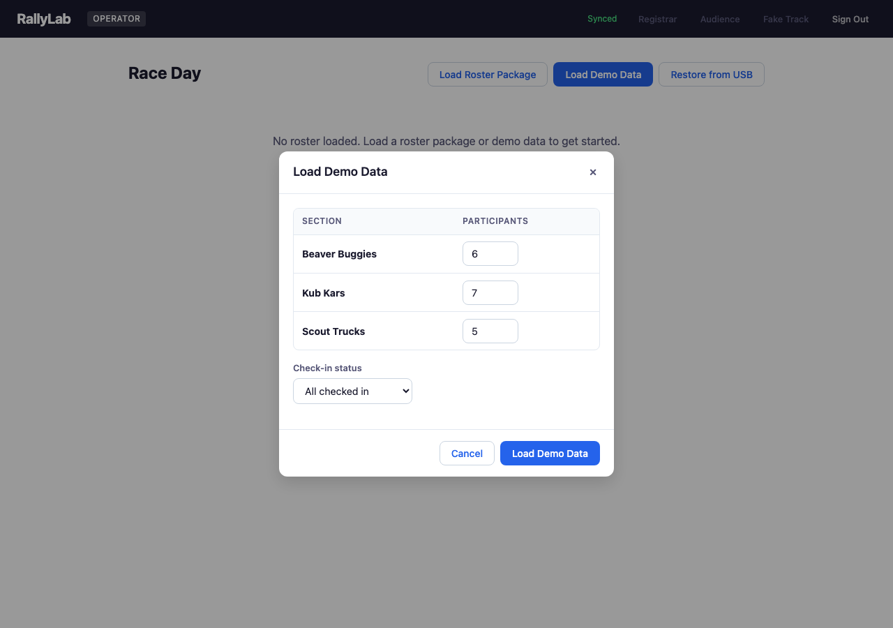
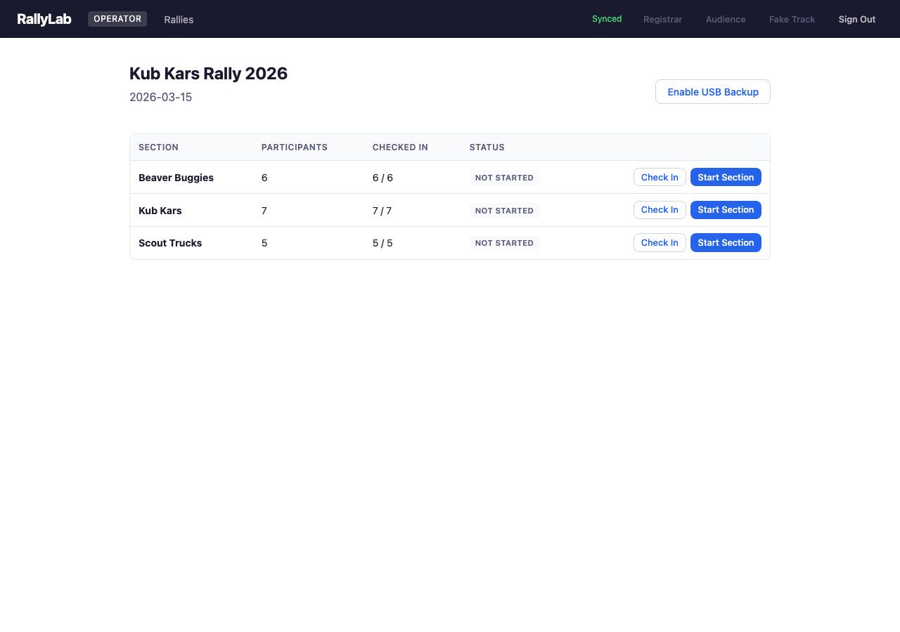
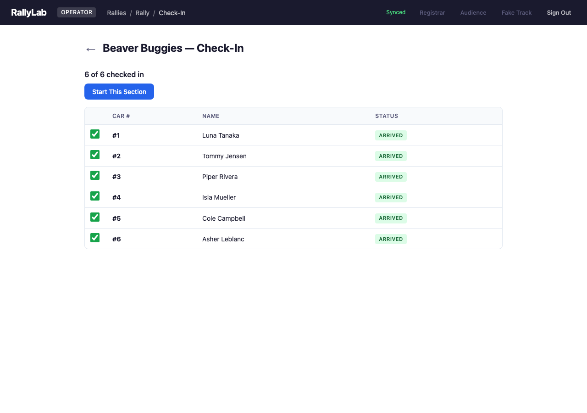
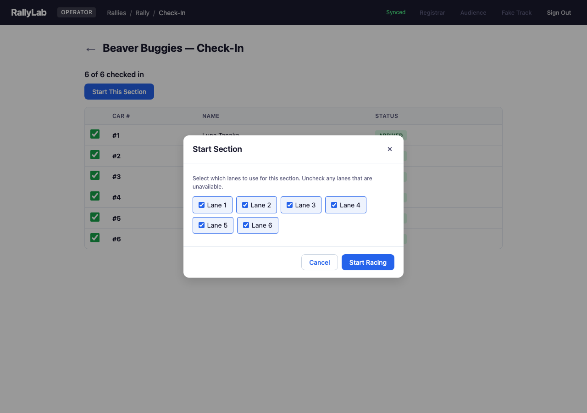
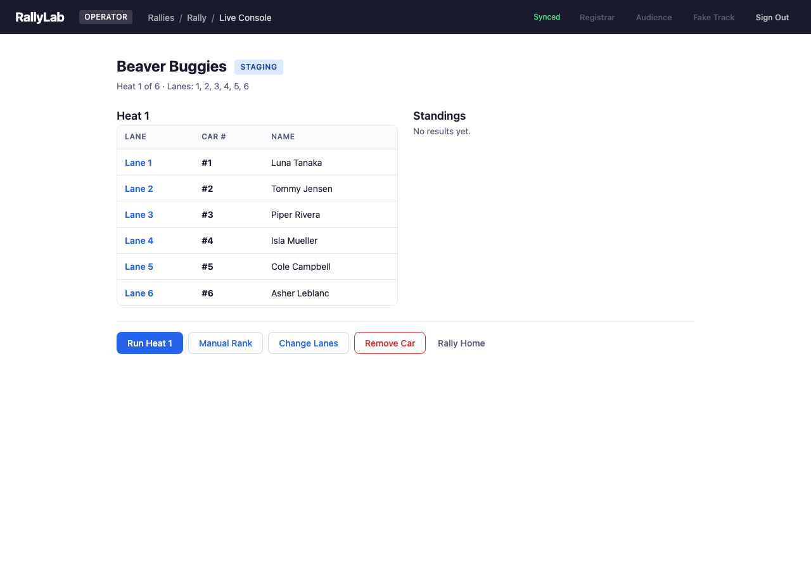
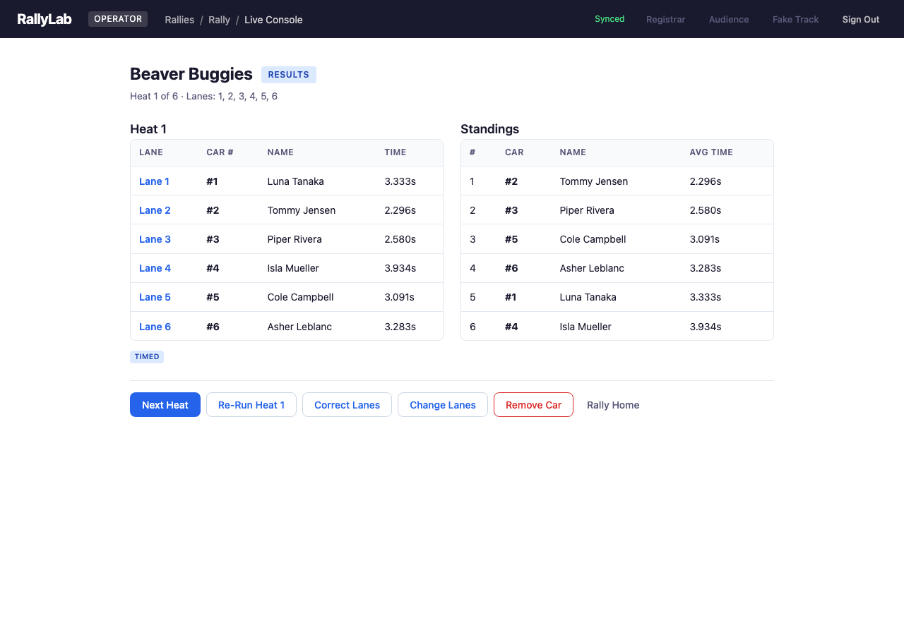
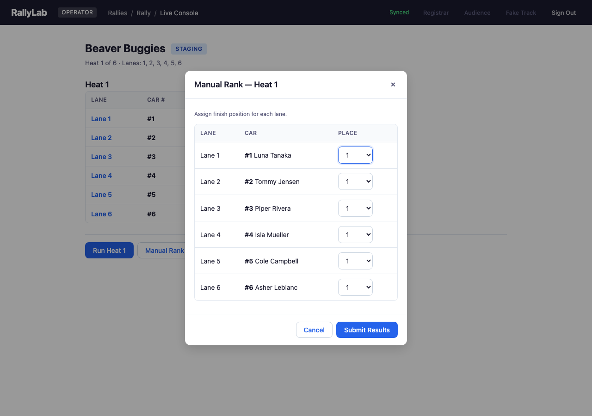
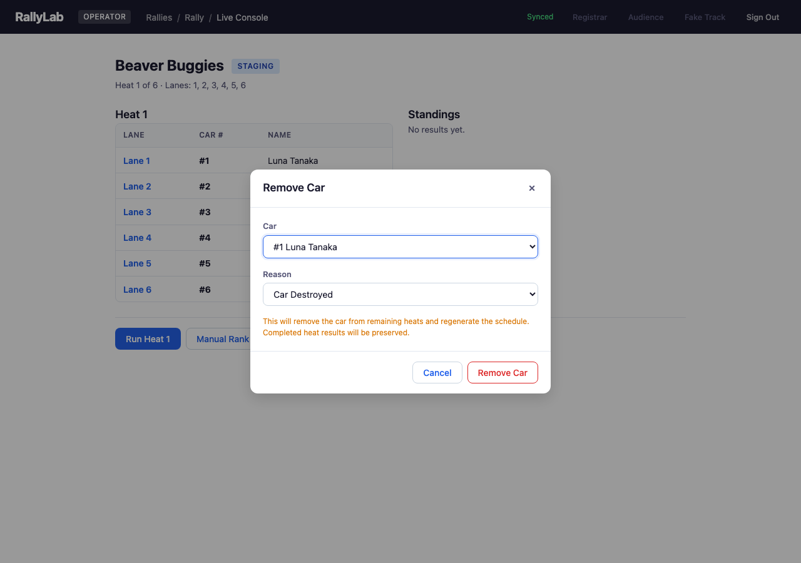
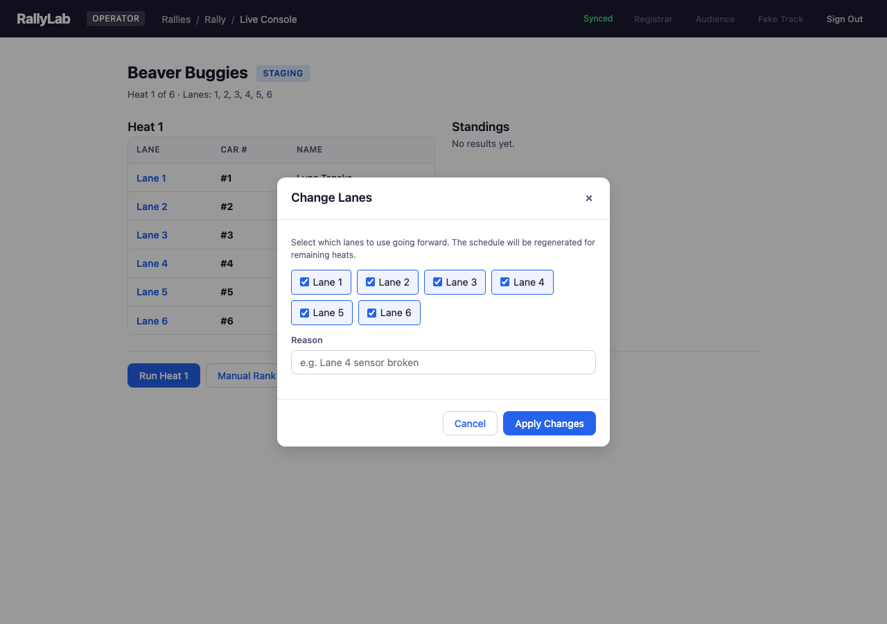
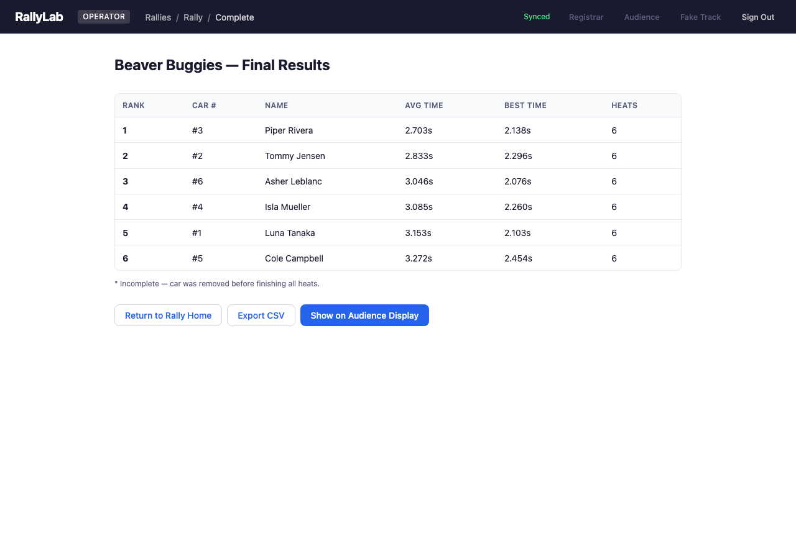

# Chapter 3: Race Day — Operator Console

## 3.1 Loading Race Data

On race day, the operator loads participant data either from a roster package exported during pre-race, or by loading demo data for testing. The demo data dialog lets you configure the number of participants per section and their check-in status.

## 3.2 Rally Home

The operator rally home shows all sections with their participant counts, check-in progress, and status. From here you can check in participants, start racing a section, or view the live console for an active section.

## 3.3 Check-In

The check-in screen shows all participants in a section with checkboxes to mark their arrival. Once at least 2 participants are checked in, the "Start This Section" button becomes available.

## 3.4 Starting a Section

The Start Section dialog lets you choose which lanes to use. Uncheck any lanes that are unavailable (e.g., broken sensor). The schedule is automatically generated based on available lanes and checked-in participants.

## 3.5 Live Console — Staging

During staging, the live console shows the current heat assignment with lane numbers, car numbers, and participant names. The "Run Heat" button triggers the race (in manual mode) or the system waits for the track controller to detect the start gate release.

## 3.6 Live Console — Results

After a heat completes, the results panel shows finish times for each lane. The standings panel on the right updates with cumulative average times. Click "Next Heat" to advance to the next heat, or "Re-Run" if there was an issue.

## 3.7 Manual Rank

If the timing system fails for a heat, use Manual Rank to enter finish positions by hand. Assign a place (1st, 2nd, etc.) or DNF to each lane.

## 3.8 Remove Car

Remove a car from the remaining heats if it is destroyed, disqualified, or withdrawn. Completed heat results are preserved. The schedule is regenerated for remaining heats.

## 3.9 Change Lanes

Change which lanes are active mid-race (e.g., if a lane sensor breaks). The schedule is regenerated for remaining heats using the new lane configuration.

## 3.10 Section Complete / Final Results

When all heats are finished, the section complete screen shows final standings with rank, average time, best time, and heat count. Results can be exported to CSV or sent to the audience display for a dramatic progressive reveal.

