# Chapter 2: Pre-Race Registration

## 2.1 Rally List

The rally list shows all rallies you have access to. From here you can create a new rally or manage an existing one.

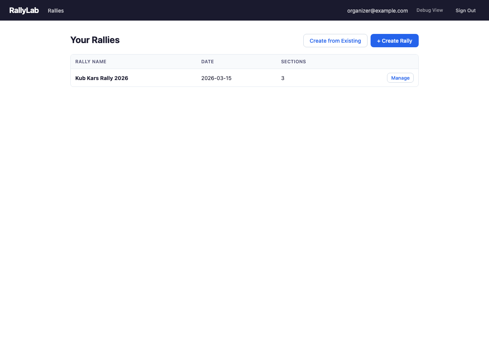

## 2.2 Rally Home (Organizer Dashboard)

The rally home screen is the central dashboard for managing a rally before race day. It shows sections with participant counts, groups, invited registrars, and operators. Use the action buttons to add sections, groups, and invite collaborators.

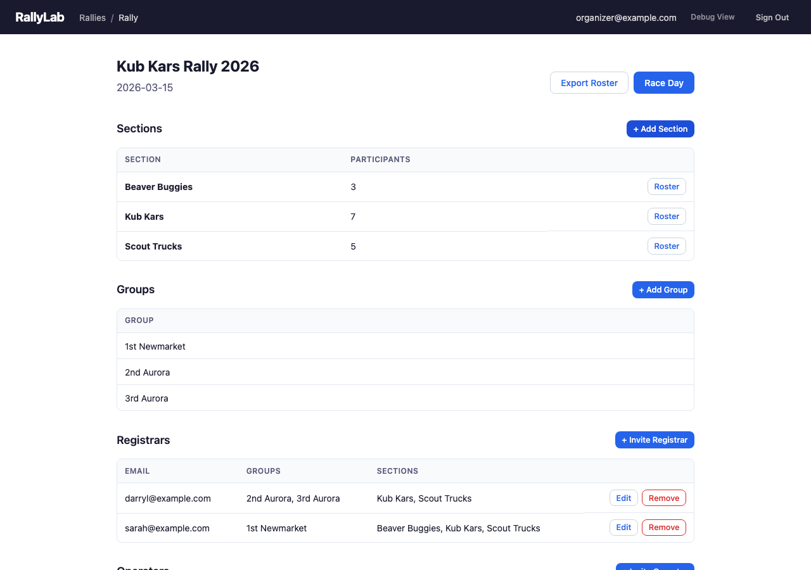

## 2.3 Section Detail — Full Roster

The section detail view shows all participants in a section, organized by group. Each participant shows their assigned car number and name. You can upload a roster from a spreadsheet or add participants individually.

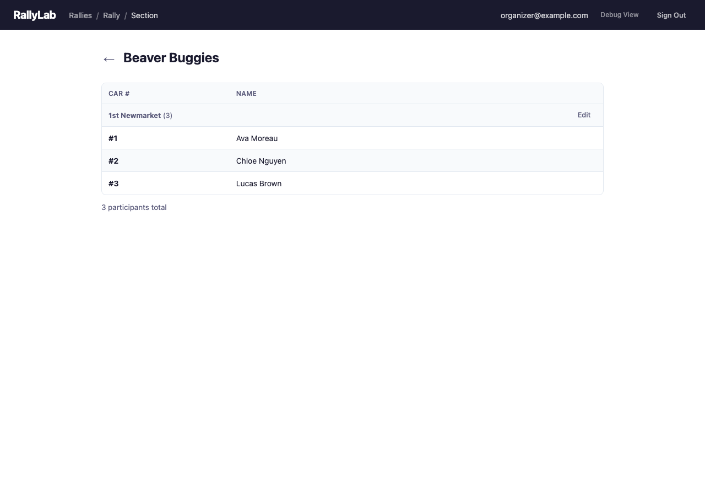

## 2.4 Section Detail — Group Roster

When viewing a section filtered by group, only participants from that group are shown. This is the view a registrar sees when managing their assigned group.

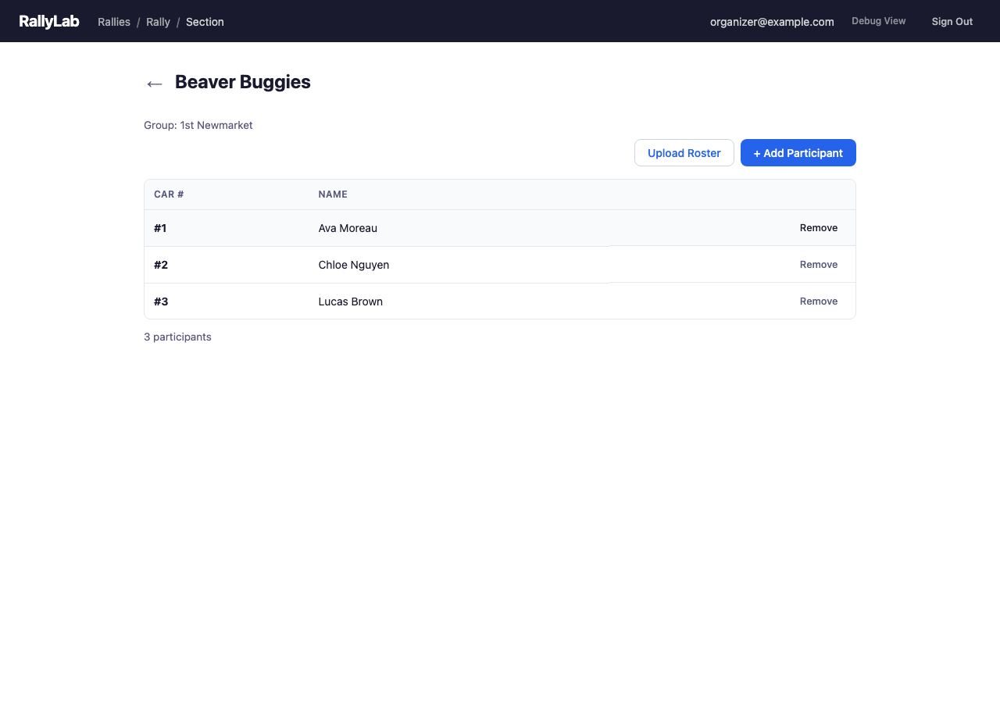

## 2.5 Creating a Rally

The Create Rally dialog lets you set the rally name and date. After creation, you can add sections, groups, and invite collaborators.

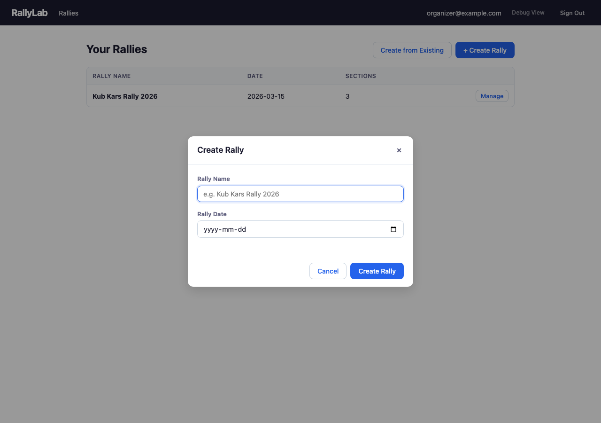

## 2.6 Create from Existing Rally

If you're running a similar event again, use "Create from Existing" to clone an existing rally's sections, groups, and full participant roster into a new rally. Select the source rally, give the new one a name and date, and all participants are copied with fresh car numbers.

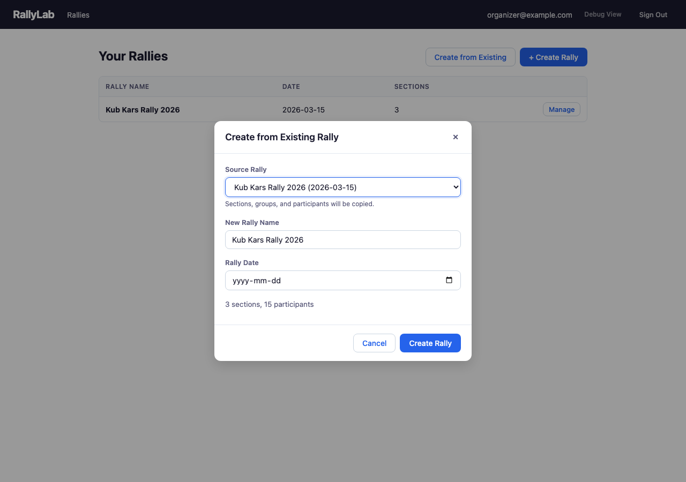

## 2.7 Adding Sections

Add sections to organize your rally by age group or category. Common sections are Beaver Buggies, Kub Kars, and Scout Trucks.

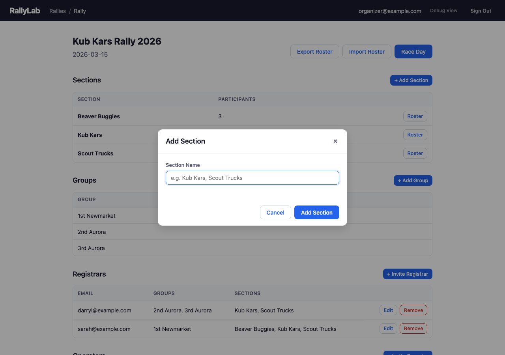

## 2.8 Adding Groups

Groups represent Scout troops or packs (e.g., "1st Newmarket", "2nd Aurora"). Groups help organize participants and can be assigned to registrars for distributed check-in.

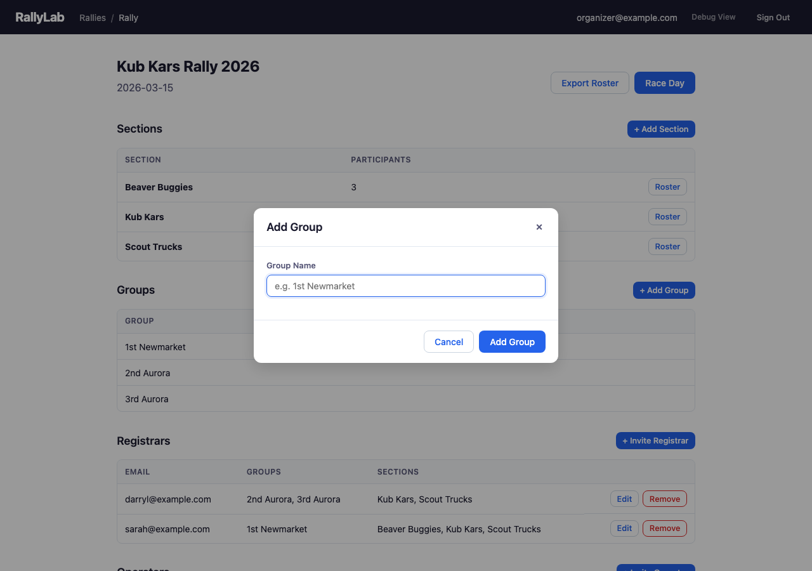

## 2.9 Uploading a Roster

Upload participants from a CSV or Excel spreadsheet. The system automatically detects column mappings for participant names and group assignments.

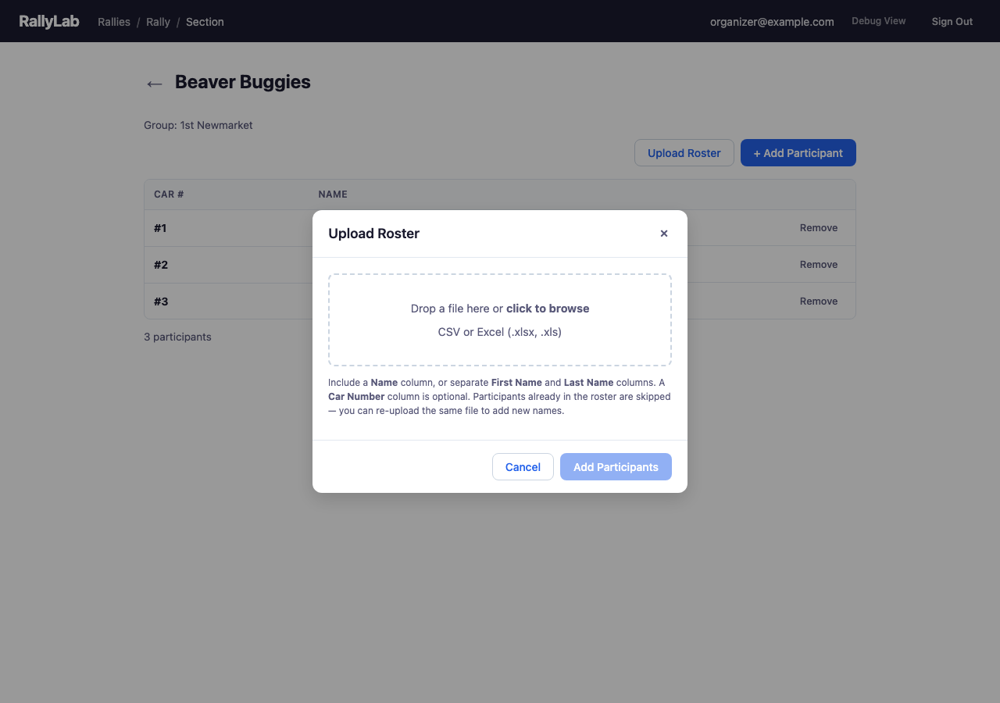

## 2.10 Adding a Participant

Add individual participants manually. A car number is automatically assigned based on the next available number in the section.

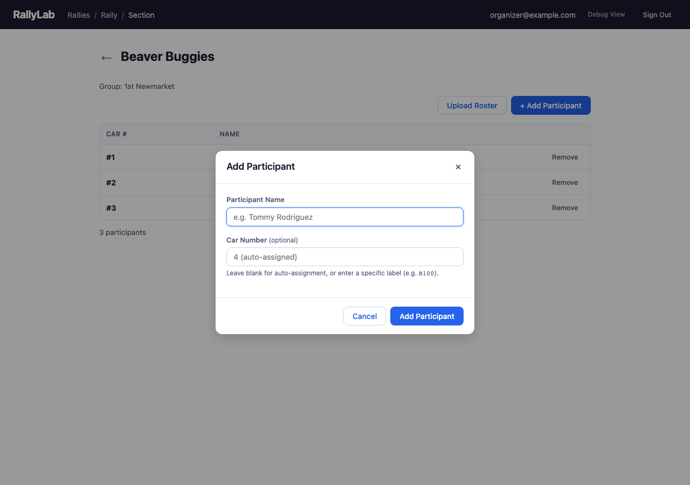

## 2.11 Inviting a Registrar

Invite a registrar by email to help manage check-in on race day. You can assign them to specific groups and sections, controlling what they can see and manage.

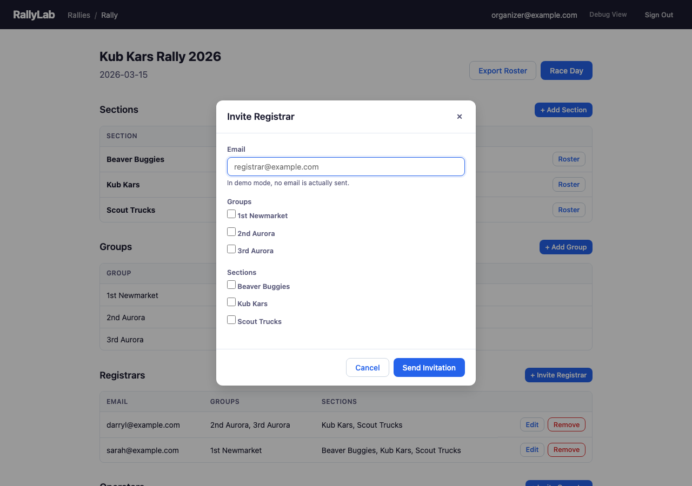

## 2.12 Inviting an Operator

Invite an additional operator by email to help run the race day console. Operators have full control over the race flow.

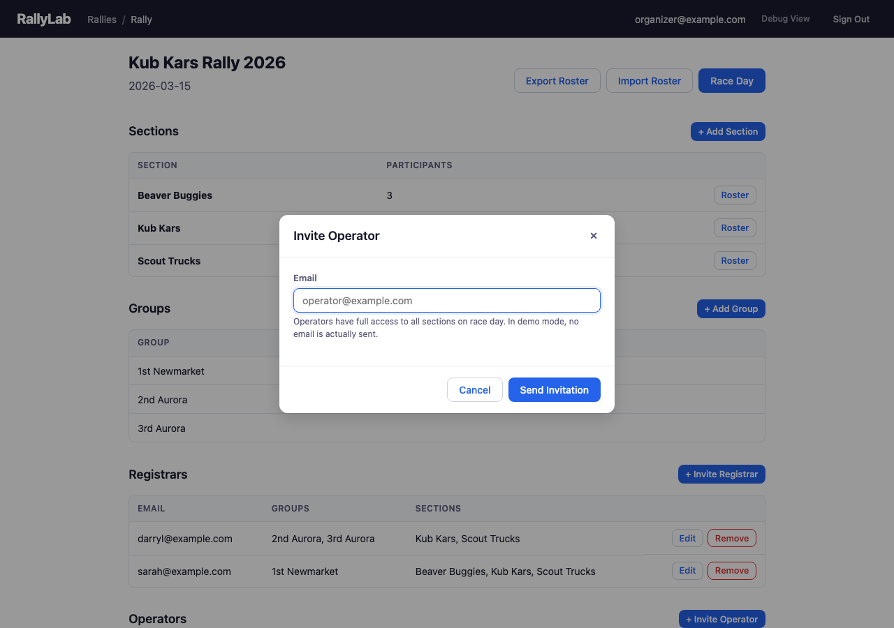
