# Chapter 3: Race Day — Operator Console

## 3.1 Loading Race Data

On race day, the operator loads participant data either from a roster package exported during pre-race, or by loading demo data for testing. The demo data dialog lets you configure the number of participants per section and their check-in status.

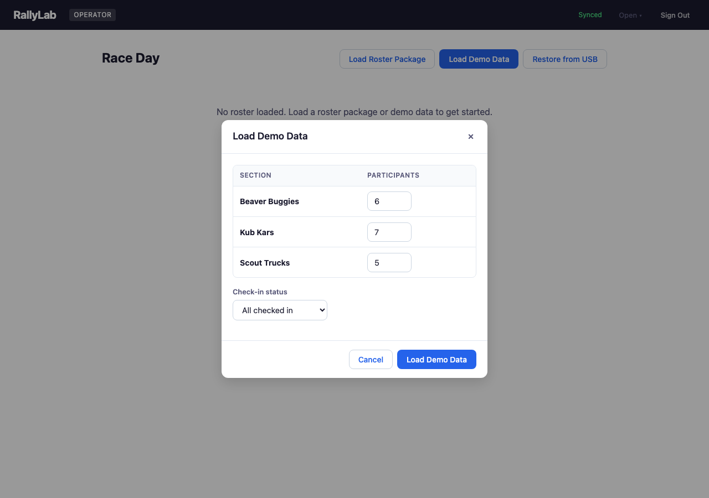

## 3.2 Rally Home

The operator rally home shows all sections with their participant counts, check-in progress, and status. From here you can check in participants, start racing a section, or view the live console for an active section. The track connection badge in the top-right opens the Track Manager.

**Entrants (PDF)** and **Entrants (Excel)** buttons below the section table produce a printable entrants list — one page or sheet per section, with an "Arrived" column you can tick off on paper. Useful as a check-in sheet at the door or for handing to a section lead before racing starts.

## 3.3 Track Connection

Click the track badge on the Rally Home or Live Console screen to open the Track Manager dialog. RallyLab supports three ways to connect to a Pico W track controller, plus a manual fallback:

- **WiFi** — Enter the Pico's IP address and click Connect WiFi. The controller communicates over HTTP, so no USB cable is needed during the race. The IP is remembered for reconnection.
- **USB** — Click Connect USB to use Web Serial (Chrome/Edge only). While connected via USB, you can also configure the Pico's WiFi from the Track Manager — scan for networks, enter a password, and switch to wireless.
- **Fake Track** — Open the fake track simulator (`debug.html`) in another tab. It connects automatically via BroadcastChannel for testing without hardware.
- **Manual** — No track controller. The operator clicks "Run Heat" and "Next Heat" buttons to advance through the race, and uses Manual Rank to enter results by hand.

When a track is connected (WiFi, USB, or Fake), gate release and finish times are detected automatically. The connection status is shown as a badge on both the Rally Home and Live Console screens.

When connected via USB or WiFi, the Track Manager also shows a **Sensor Status** panel with live readings from the gate switch and each lane sensor. This helps diagnose hardware issues — you can see whether the gate registers as open or closed, and whether individual lane sensors are triggering correctly.

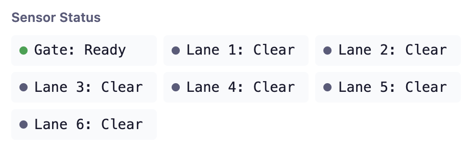

## 3.4 Check-In

The check-in screen shows all participants in a section with checkboxes to mark their arrival. Once at least 2 participants are checked in, the "Start This Section" button becomes available.

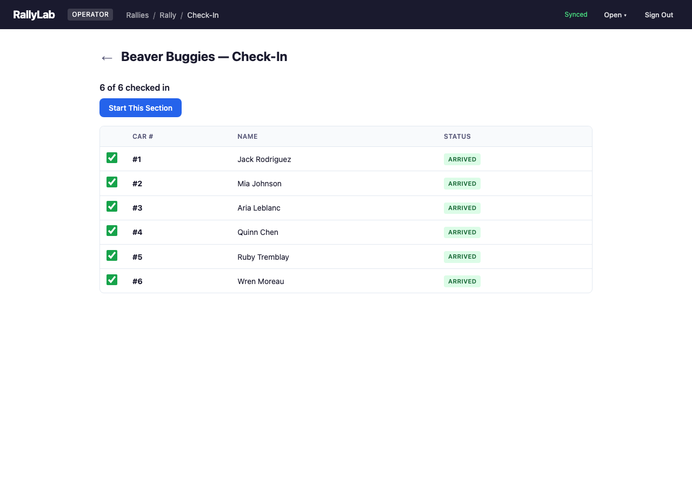

## 3.5 Starting a Section

The Start Section dialog lets you choose which lanes to use. Uncheck any lanes that are unavailable (e.g., broken sensor). The schedule is automatically generated based on available lanes and checked-in participants.

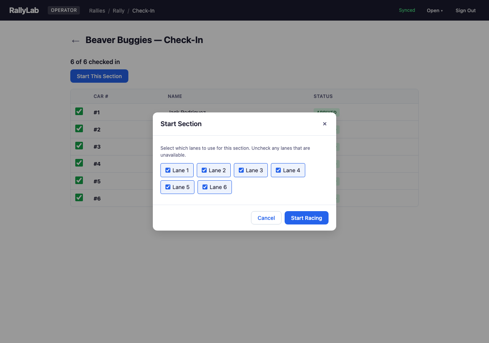

## 3.6 Live Console — Staging

During staging, the live console shows the current heat assignment with lane numbers, car numbers, and participant names. With a connected track, the system automatically detects the start gate release. In manual mode, click "Run Heat" to advance.

The header shows the connection mode (USB Track, WiFi Track, Fake Track, or Manual) and a **track phase badge** indicating the current state — Staging, Waiting for gate, Waiting for race, or Result. Click the phase badge to expand a timestamped log of phase transitions, which is useful for diagnosing timing issues.

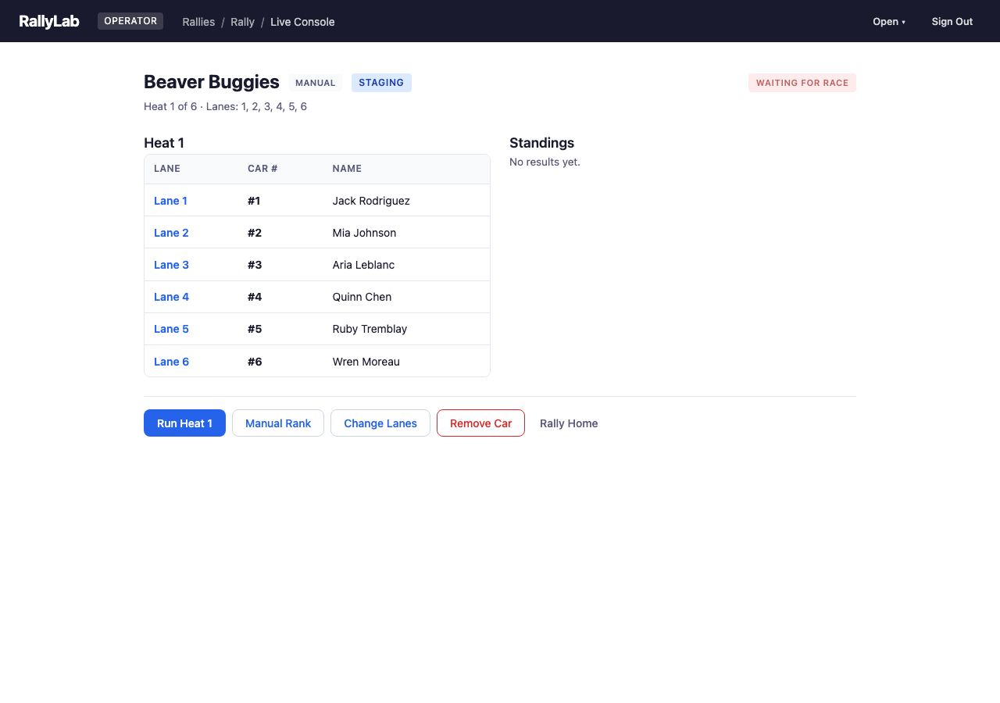

## 3.7 Live Console — Results

After a heat completes, the results panel shows finish times for each lane. If a car did not finish, its time shows as **DNF** (Did Not Finish). The standings panel on the right updates with cumulative average times. Click "Next Heat" to advance to the next heat, or "Re-Run" if there was an issue.

If a heat has DNF results, a **Re-Run DNF** button appears, allowing you to re-run only the cars that didn't finish while keeping the successful results. This is also available in the heat history for past heats.

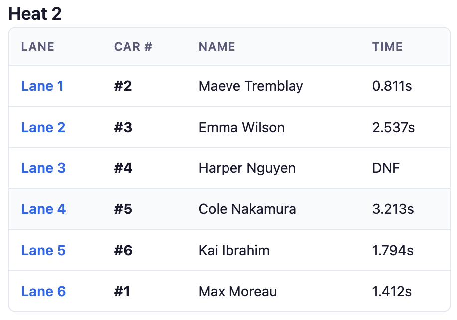

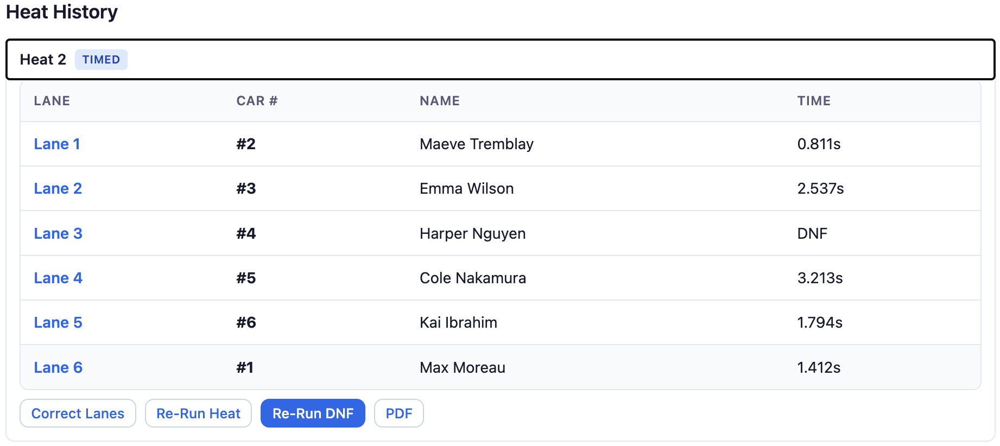

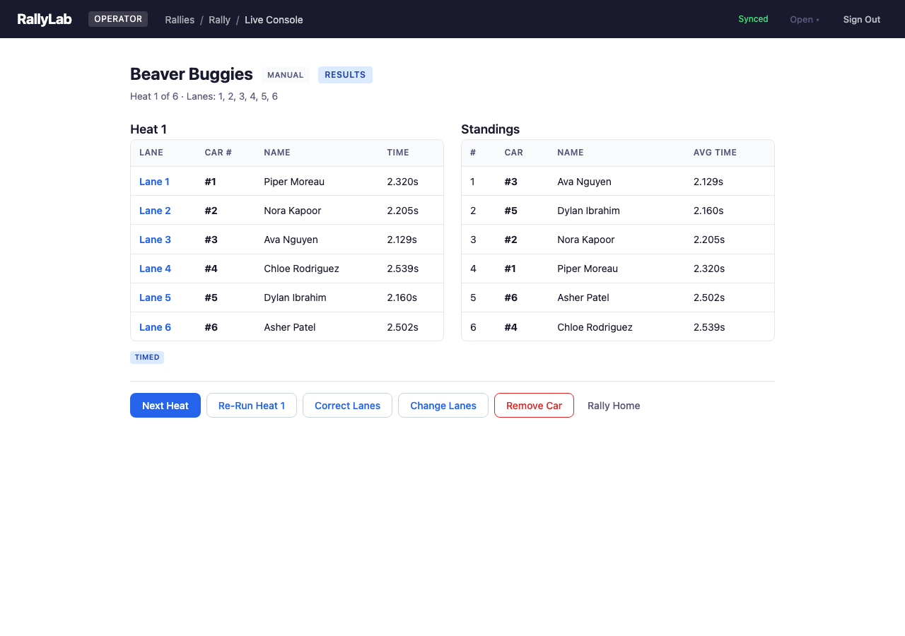

## 3.8 Manual Rank

If the timing system fails for a heat, use Manual Rank to enter finish positions by hand. Assign a place (1st, 2nd, etc.) or DNF to each lane.

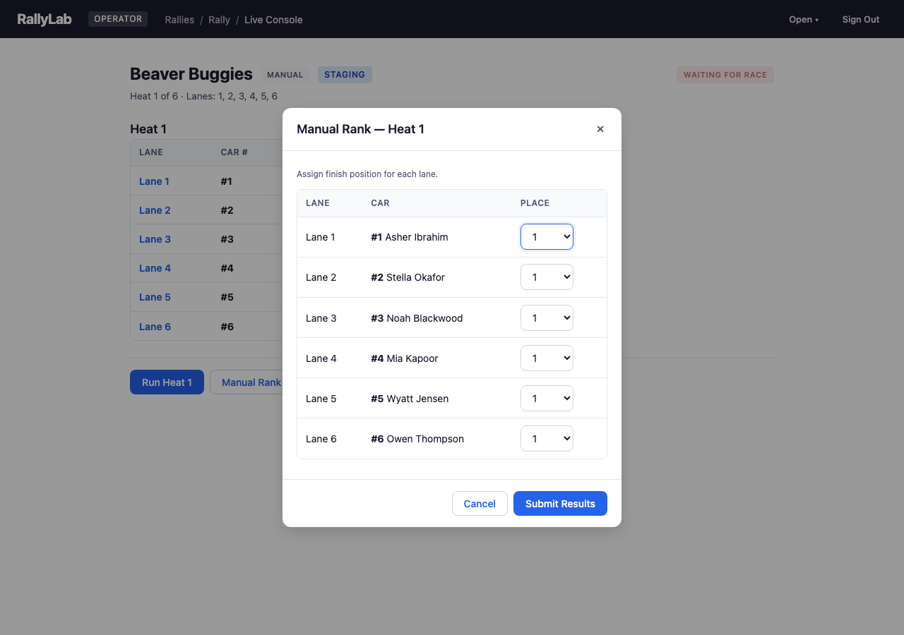

## 3.9 Remove Car

Remove a car from the remaining heats if it is destroyed, disqualified, or withdrawn. Completed heat results are preserved. The schedule is regenerated for remaining heats.

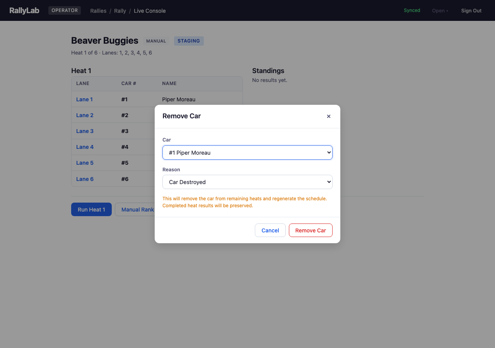

## 3.10 Change Lanes

Change which lanes are active mid-race (e.g., if a lane sensor breaks). The schedule is regenerated for remaining heats using the new lane configuration.

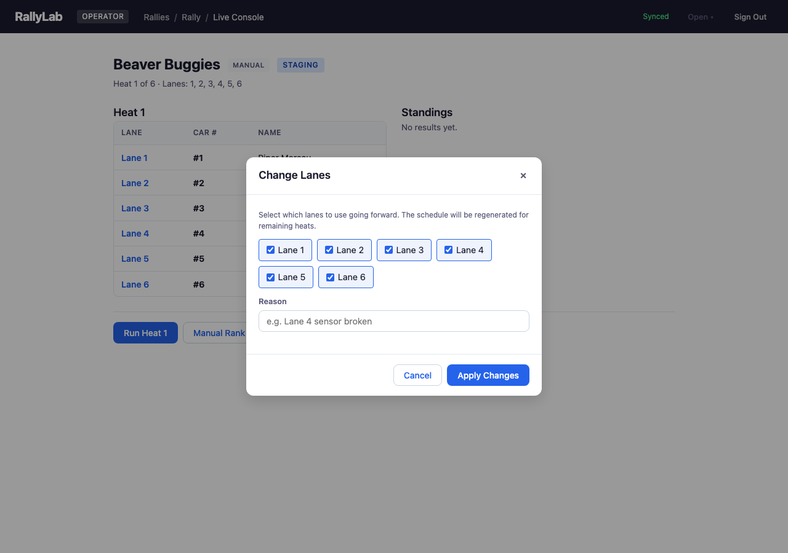

## 3.11 Section Complete / Final Results

When all heats are finished, the section complete screen shows final standings with rank, average time, best time, and heat count.

From this screen you can:

- **Export Excel** — Download a multi-sheet workbook with standings, heat-by-heat results, car statistics, and lane statistics
- **Export PDF** — Generate a detailed PDF report with standings, per-heat results, and car/lane statistics
- **Show on Audience Display** — Send results to the audience display for a dramatic progressive reveal, starting from last place and building up to first

If a section has been run multiple times (multiple rotations that were completed separately), a **start picker** appears at the top to switch between results for each run.

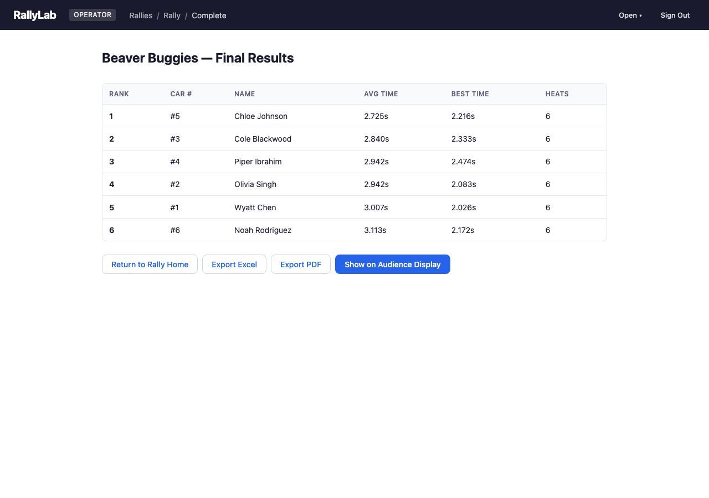

## 3.12 Car Statistics

Click **Car Stats** (available in the Live Console after at least one heat has results) to open a detailed per-car breakdown. The table shows each car's time on every lane, plus their average, best time, and total heats run. This helps identify cars that are consistently fast or slow on specific lanes.

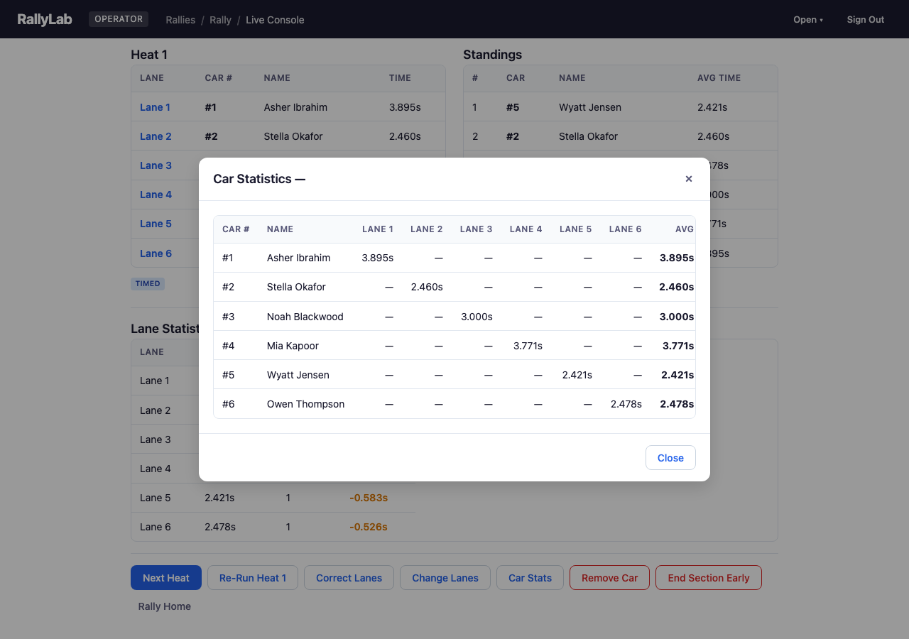

## 3.13 Lane Diagnostics

The **Lane Statistics** panel appears automatically below the standings in the Live Console after results are recorded. It shows the average time, race count, and deviation from the overall average for each lane. Lanes with a deviation greater than 20ms are highlighted as outliers — this can indicate a lane that is consistently faster or slower, which may point to a track alignment issue.

## 3.14 Multiple Rotations

After all heats in a rotation are complete, a **rotation decision** prompt appears with two options:

- **Add Rotation** — Schedule another full rotation of heats for the same participants. Useful when time allows for more racing to improve scoring accuracy.
- **Complete Section** — Finalize the section with the current results.

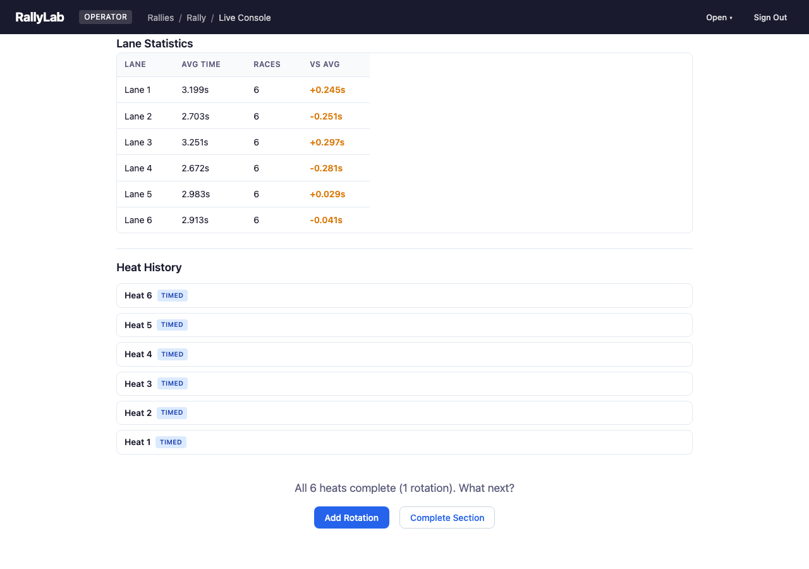

## 3.15 End Section Early

If you're running short on time, click **End Section Early** (the red button in the Live Console) to stop racing and finalize standings based on heats completed so far. Cars that ran fewer heats than others are marked as incomplete in the final results. This button only appears after at least one heat has been completed.

## 3.16 Reports

The operator can generate PDF reports from several places:

- **Entrants List** (from Rally Home) — A printable per-section roster with an "Arrived" column for paper check-in. Also available as Excel.
- **Rally Report** (from Rally Home) — A multi-page PDF covering all sections, with standings, lane statistics, and summary stats for the entire event.
- **Group Reports** (from Rally Home) — Per-group PDFs showing where each group's participants placed and their heat-by-heat times. Useful for handing to scout leaders.
- **Section Report** (from Section Complete) — A detailed single-section PDF with standings, lane statistics, heat-by-heat results, and a car statistics matrix.
- **Heat Report** (from Heat History) — A quick single-page snapshot of one heat's results and current leaderboard.

All reports are generated client-side using jsPDF — no server needed.

## 3.17 Learn Pin Mapping

When connecting a new Pico W track controller for the first time, use **Learn Pins** to teach RallyLab which GPIO pins are wired to the gate switch and each lane sensor. Open the Track Manager (click the track badge), then click **Learn Pins** in the footer.

The wizard walks you through each sensor one at a time:

1. **Open the start gate** — release the gate lever or press the gate button. The Pico detects which pin changed and records it.

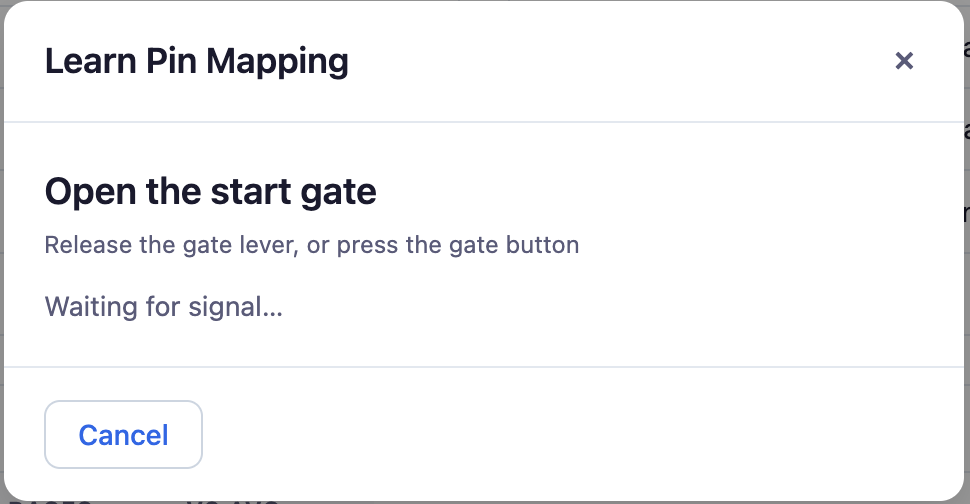

2. **Trigger each lane sensor** — push a car across each finish line in order. Each detected pin is added to the mapping.

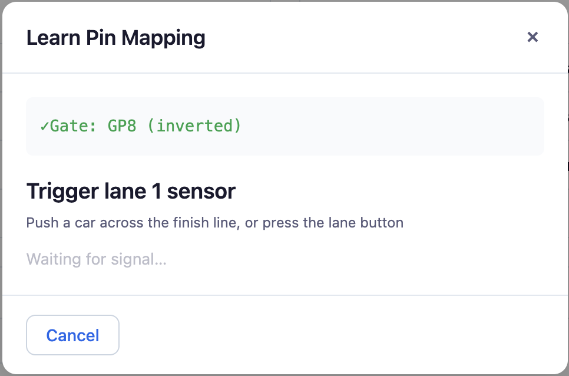

3. **Save & Restart** — once all lanes are mapped, click Save to write the pin configuration to the Pico and restart the firmware.

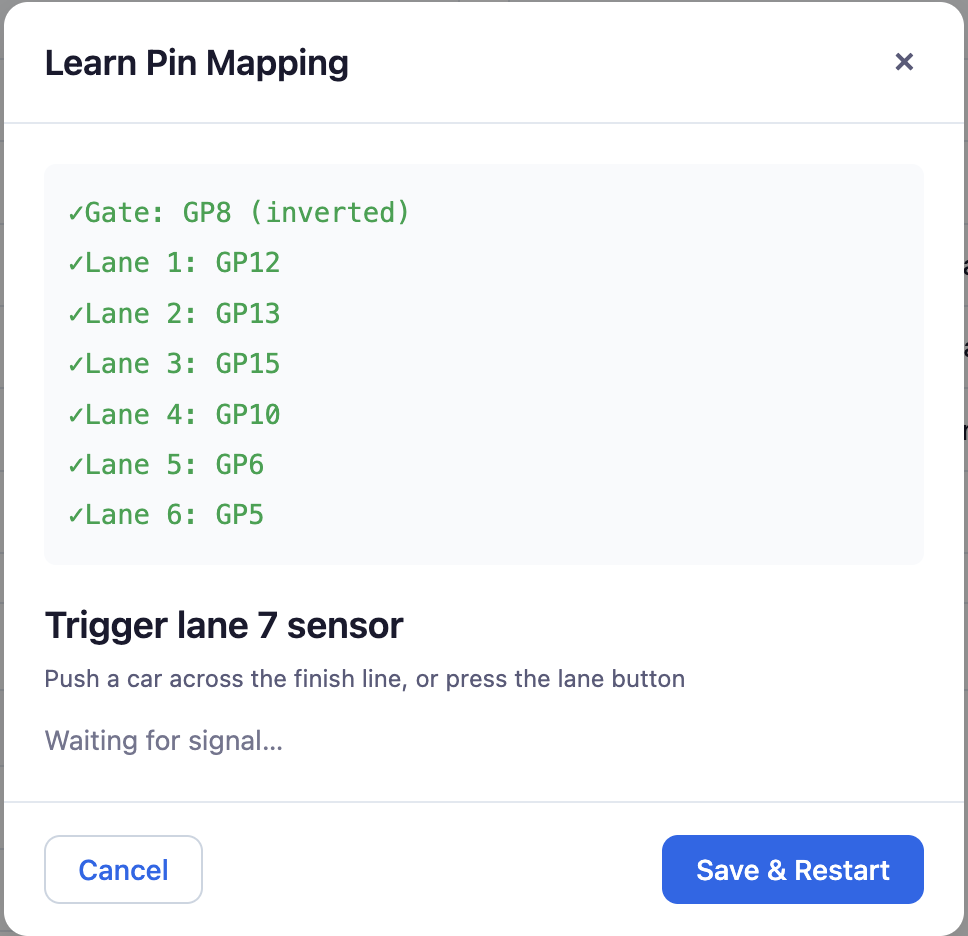
