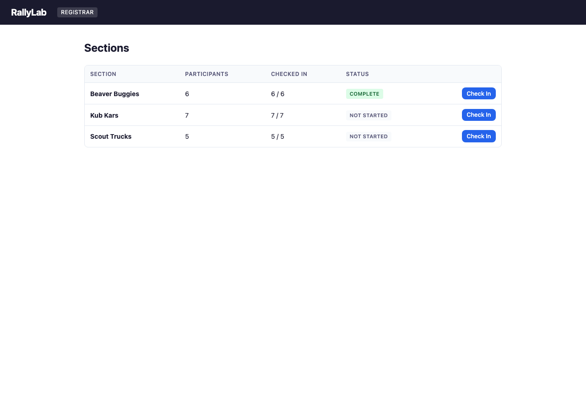
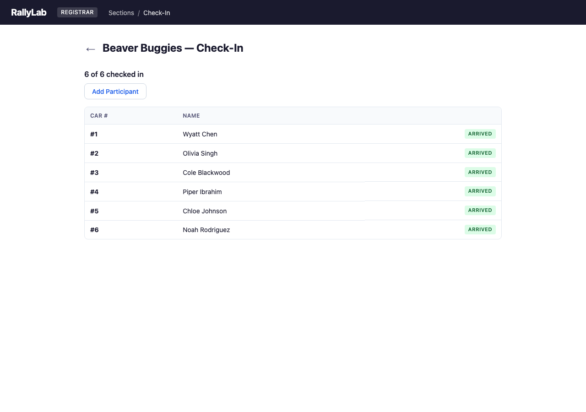
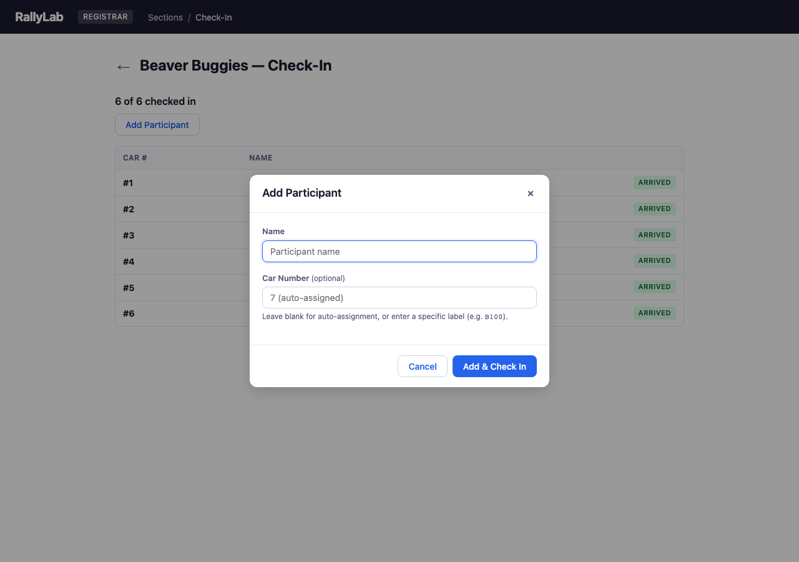

# Chapter 4: Race Day — Registrar

The registrar interface is a simplified check-in view designed for group leaders and section contacts. It shares the same data as the operator console via IndexedDB, so changes made by registrars appear immediately on the operator screen.

## 4.1 Section List

The registrar section list shows all sections with participant counts, check-in progress, and status badges.

## 4.2 Section Check-In

The registrar check-in screen shows each participant with a "Check In" button. Checking in a participant marks their car as arrived and updates the count. Late arrivals after racing has started will trigger schedule regeneration.

## 4.3 Adding a Late Participant

The "+ Add Participant" button handles walk-up registrations. Enter the name; leave Car Number blank to auto-assign the next available number, or type a specific label to match the physical car. The participant is added and checked in immediately — and if a section is already racing, the schedule regenerates with catch-up heats.

