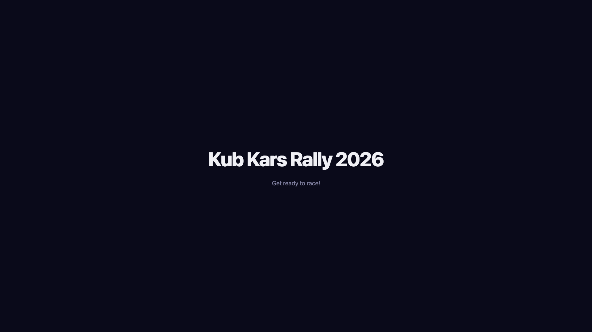
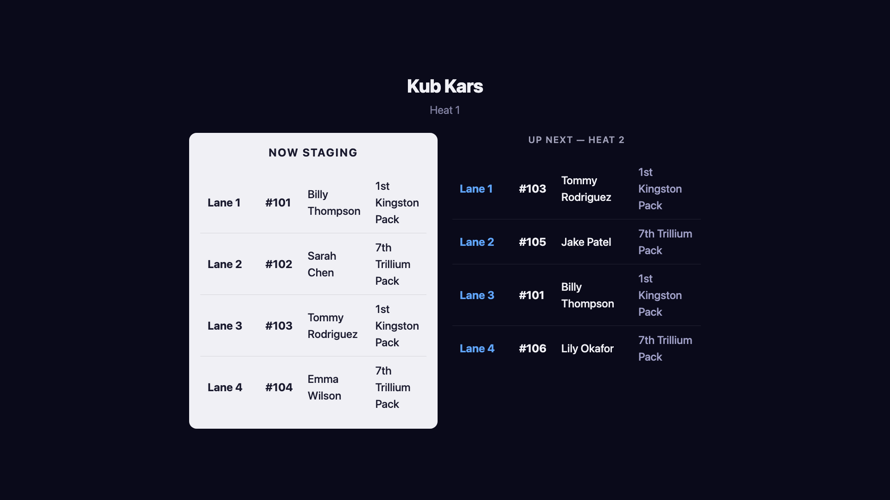
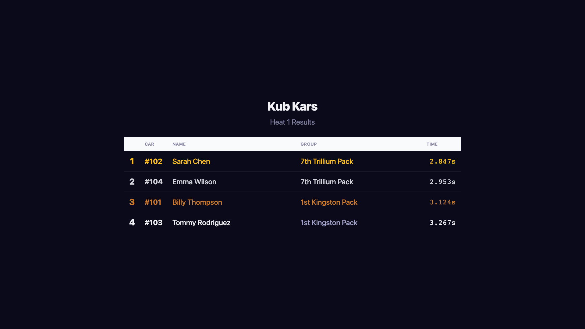
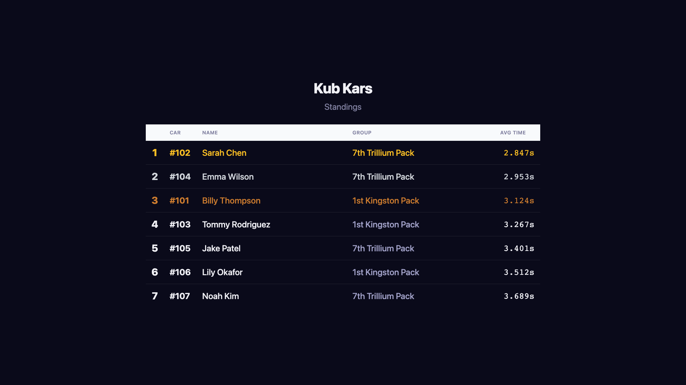
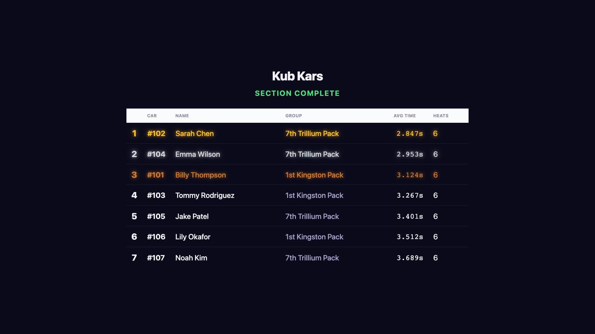

# Chapter 5: Audience Display

The audience display is designed for projectors and large screens. It uses a dark theme with large fonts for maximum visibility. The display is controlled by the operator — it automatically shows the current heat staging, results, and leaderboard as racing progresses.

When a participant belongs to a group (e.g., a pack or colony), the group name appears alongside their car number on every screen, so scouters can track how their group is doing at a glance. The Group column is only shown when at least one participant in the section has a group assigned.

## 5.1 Welcome

The welcome screen displays the rally name and is shown before racing begins.

## 5.2 Heat Staging

During staging, the audience sees the current heat with lane assignments and an "Up Next" preview of the following heat. This helps participants prepare and builds anticipation.

## 5.3 Heat Results

After each heat, results are displayed with finish times and place indicators (gold, silver, bronze medals for the top 3).

## 5.4 Leaderboard

The leaderboard shows cumulative standings based on average times across all heats completed so far.

## 5.5 Section Complete (Progressive Reveal)

When a section finishes, the operator can trigger a dramatic reveal of final standings — starting from last place and building up to first. Medals animate in for the top 3 finishers.

