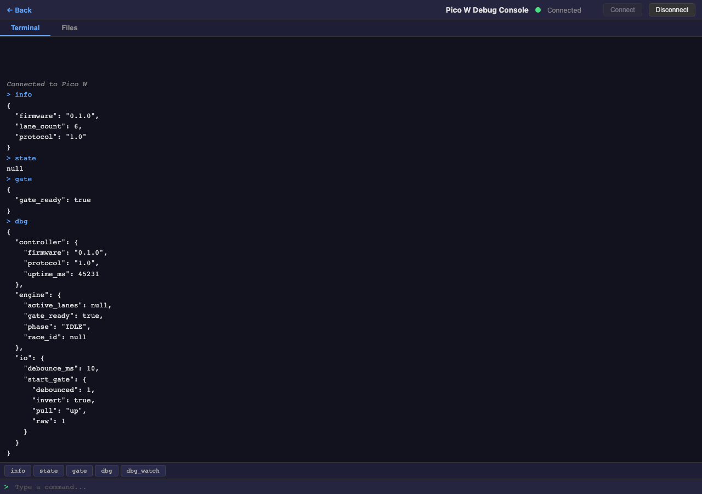
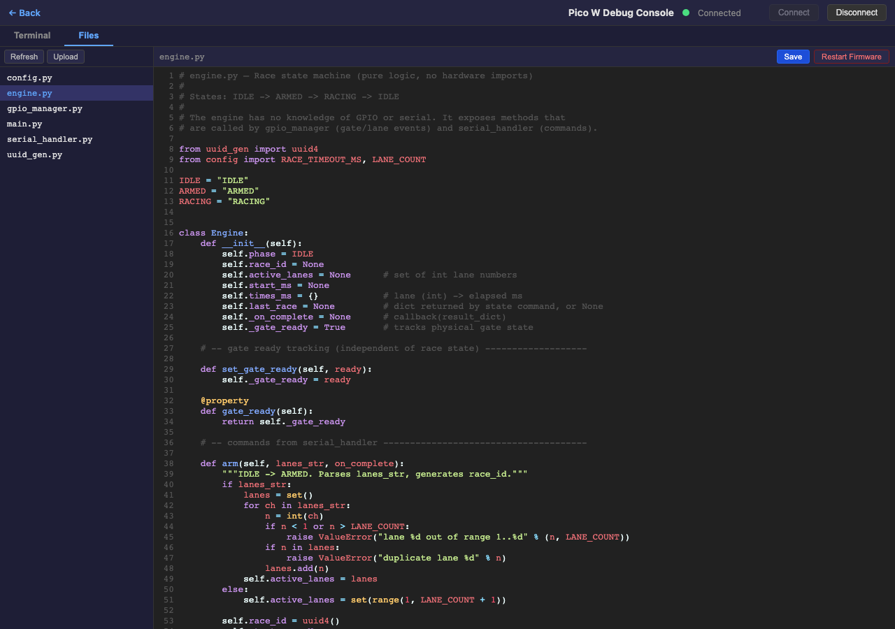

# Chapter 7: Pico W Debug Console

The Pico W Debug Console is a browser-based tool for communicating with the track controller's Raspberry Pi Pico W over USB serial. It provides a serial terminal for sending commands and a file editor for managing MicroPython firmware files directly on the device.

**Requires Chrome or Edge on desktop** — the console uses the Web Serial API, which is not available in Firefox or Safari.

## 7.1 Connecting

Click **Connect** in the header toolbar and select the Pico W from the browser's serial port picker. The status indicator turns green when connected. Click **Disconnect** to release the port.

## 7.2 Terminal Tab

The terminal tab provides a serial console for interacting with the Pico W firmware.

- Type a command in the input field and press **Enter** to send it
- Use **Up/Down arrow keys** to recall previous commands from history
- Quick-command buttons below the output send common commands with one click: `info`, `state`, `gate`, `dbg`, `dbg_watch`

Output is color-coded: commands in blue, responses in white, errors in red, and system messages in gray italic.

## 7.3 Files Tab

The files tab provides a file browser and code editor for MicroPython files stored on the Pico W.

- **File list** (left panel) — shows all files on the device. Click a filename to open it in the editor. Click **Refresh** to reload the file list
- **Editor** (right panel) — CodeMirror editor with Python syntax highlighting. Edit the file and click **Save** (or press **Cmd/Ctrl+S**) to write it back to the device
- **Upload** — upload a `.py` file from your computer to the Pico W
- **Restart Firmware** — soft-resets the Pico W to reload the firmware with any saved changes

